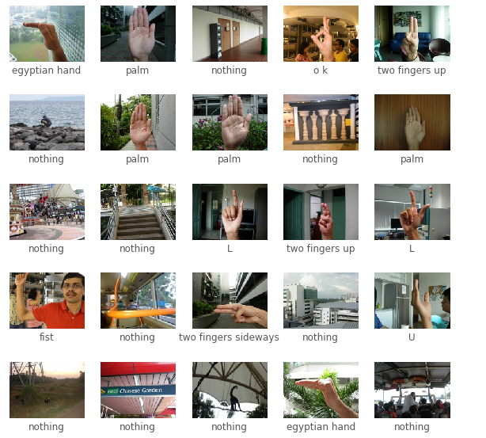

# Hi, I'm Brooks.
## [About me](#about-me)
My name is Brooks(Ruijia) Niu and I am a third year computer science & cogsci double major student in Marshall college at UCSD. I am interested in machine learning and have been working on several projects such as gesture recognition and generative neural networks. Feel free to contact me if you have similar interests! Aside of the academic stuff, I love ping pong and sci-fi movies. ~~Also I play first person shooter games **a lot**~~. 

---
## [The thing I have been working on recently](#the-thing-i-have-been-working-on-recently)

In the words of a lot of people:
> You need to try something new

Here is the [gesture recognition model](https://github.com/brooksniu/gesture-recognition-browser):
 I did the data processing and visualization part and helped a little on building and training the neural network. 

##### [A peek at the accuracy records through training](acc.PNG)

To try out the model, simply download the code & dataset. After the training is finished, use ```
guess(model, index, x_test = x_test)``` and ```plot_prediction(index, output, true_class_names = true_class_names, class_names = class_names)``` to make predictions & visualize the results!

---
## [Things to do in the future](#things-to-do-in-the-future)
1. Learn how modern software engineers develop an app.
     - What is the general workflow.
     - What are the perspectives to consider during development.
     - What qualifies as a good app.
     - *"User friendly"*
2. Get started with the ACM club.
3. Play Half-life series from the beginning
   - [ ] Half-life
   - [X] Half-life 2

---
#####   contact: rniu@ucsd.edu